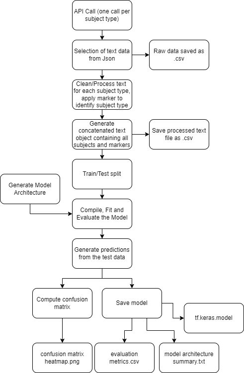

# Natural langauge processing of scientific papers
## Overview
The complexities of research writing results in text data that is difficult to parse and has high variance across text sources. Because of this, research papers present a unique opportunity to observe the effects of text processing parameters in natural language models. Although this is a first attempt at building a neural network, it has served as a learning excersise into the complexities of API's, data visualisation, tensorflow and keras. 

## API's
The Core Data API has been used as the primary source of data throughout this project and has been critical in building datasets which are reliable, accurate and easily accessable. Core Data provide open access to research papers via an API key.

If you want to run the code in this repo, you will have to sign up for an API key.

More information about Core Data can be found at https://core.ac.uk/

## Workflow
The project follows a linear path from data through to trained model and can be simplified into a flow diagram (see fig 1)

This is an active repo so additional visualisations and evaluations will be added over time.

## Using BERT
Bidirectional Encoder Representations from Transformers (BERT) is a relativly new (2018) method of encoding inputs for neural networks. BERT has particular strengths in the area of natural language processing because the encodings are actually produced from a pretrained network, this leads to text encodings that contain context before being used in a specific neural network task.

The BERT preprocessing and encoder is avaliable in Tensorflow.hub, The version of BERT used in this project is the BERT base v4, which is the most recent iteration, and consists of a 12 layer transformer stack.

The original publication about BERT can be found at: https://arxiv.org/abs/1810.04805

## Experimental variables
The goal of this project is not to produce a model with any real world application, but to explore the parameters that can be vaired for better quality NLP models, particularly when considering the methods for cleaning text data and neural network architecture.
some of the independent variables include:

- dropout layer attenuation rate
- model architecture
- activation function
- punctuation in text
- removal of hyperlinks
- removal of messy text tokens
- removal of references and names
- removal of numbers

## Hardware
The current hardware for training consists of a 
Nvidia GTX 1070 with 8gb VRAM, 8gb of system RAM

## Limitations
Evaluation of the model uses standard practises, including computing f1 scores and confusion matrices, however these computations are done using a train/test split and encompass the text processing variables within the testing dataset, this indicates that the model become somewhat accustomed to text that has been heavily processed. When predictions are made using raw text the model can eaily become confused by parameters that have been ommited during text processing.

