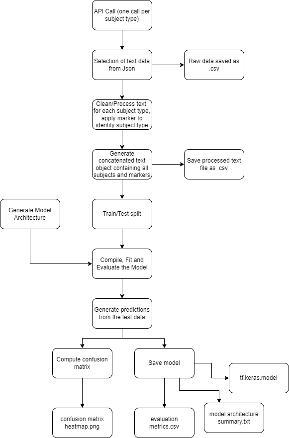

# Natural langauge processing of scientific papers
## Overview
This project has been a way for me to learn many facets of the python programming language whilst also diving deep into the complexities of API's, tensorflow and keras. 

## Core Database
The Core Data API has been used as the primary source of data throughout this project and has been critical in my development in understanding how to interact with APi's and management of json objects and large sets of data. 

## Workflow
the general workflow of the project follows a linear path and can be simplified into a flow diagram (see fig 1)

## Using BERT
the BERT NLP model is avaliable in Tensorflow.hub and is a transformer stack that has been pretrained on a vast array of data from across the internet and digital books. The version of BERT used in this project is the BERT base v4, which consists of a 12 layer transformer stack.

## Experimental variables
The goal of this project is not to produce a model with any real world application, but to explore the parameters that can be vaired for better quality NLP models, particularly when considering the methods for cleaning text data and neural network architecture.
some of the independen variables inclue:

- dropout layer attenuation rate
- model architecture
- activation function (currently using the wrong function for this type of NN)
- punctuation in text
- removal of hyperlinks
- removal of messy text tokens
- removal of references and names
- removal of numbers

## Asumptions

## Hardware
The current hardware for training consists of a 
Nvidia GTX 1070 with 8gb VRAM, 8gb of system RAM

## Limitations
Evaluation of the model uses standard practises, including computing f1 scores and confusion matrices, however these computations are done using a train/test split and encompass the text processing variables within the testing dataset, this indicates that the model become somewhat accustomed to text that has been heavily processed. When predictions are made using raw text the model can eaily become confused by parameters that have been ommited during text processing.

